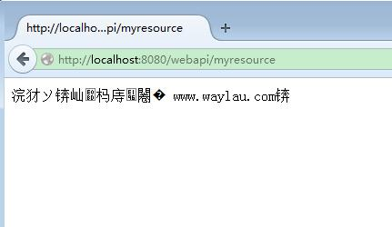
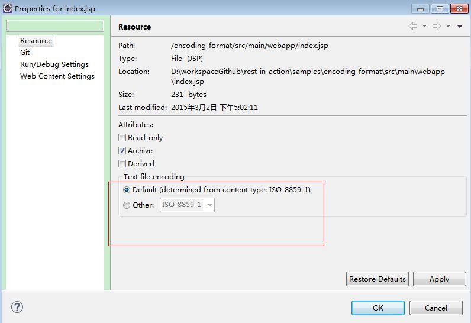

Encoding Format 处理编码问题
=========

## 中文乱码

一般的，我们都会将项目和代码设置为 UTF-8 编码格式，但有时候还远远不够。

我们在 `handle-json-xml`项目的基础上，进行修改成为另外一个新项目。

将  MyResource.java 改为如下：

```java
@Path("myresource")
public class MyResource {

    /**
     * 方法处理 HTTP GET 请求。返回的对象以"text/plain"媒体类型
	 * 给客户端
     *
     * @return String 以 text/plain 形式响应
     */
    @GET
    @Produces(MediaType.TEXT_PLAIN)
    public String getIt() {
        return "Got it!";
    }
    

    /**
     * 方法处理 HTTP GET 请求。返回的对象以"application/xml"媒体类型
	 * 给客户端
     *
     * @return MyPojo 以 application/xml 形式响应
     */
    @GET
    @Path("pojoxml")
    @Produces(MediaType.APPLICATION_XML)
    public MyBean getPojoXml() {
    	MyBean pojo = new MyBean();
    	pojo.setName("欢迎光临：waylau.com");
    	pojo.setAge(28);
        return pojo;
    }
    
    /**
     * 方法处理 HTTP GET 请求。返回的对象以"application/json"媒体类型
	 * 给客户端
     *
     * @return MyPojo 以 application/json 形式响应
     */
    @GET
    @Path("pojojson")
    @Produces(MediaType.APPLICATION_JSON)
    public MyBean getPojoJson() {
    	MyBean pojo = new MyBean();
    	pojo.setName("欢迎光临：waylau.com");
    	pojo.setAge(28);
        return pojo;
    }
    
}
```


启动项目，访问浏览器 <http://localhost:8080/>，
点击“POJO JSON” 或者 “POJO XML”，显示如下，中文已乱。



## 问题解决

在返回的数据里面，我们设置编码格式 `charset=utf-8`,关键代码如下：

```java
private final static String CHARSET_UTF_8 = "charset=utf-8";
 
@GET
@Path("pojoxml")
@Produces(MediaType.APPLICATION_XML + ";" + CHARSET_UTF_8)
public MyBean getPojoXml() {
	MyBean pojo = new MyBean();
	pojo.setName("欢迎光临：waylau.com");
	pojo.setAge(28);
    return pojo;
}

@GET
@Path("pojojson")
@Produces(MediaType.APPLICATION_JSON + ";" + CHARSET_UTF_8)
public MyBean getPojoJson() {
	MyBean pojo = new MyBean();
	pojo.setName("欢迎光临：waylau.com");
	pojo.setAge(28);
    return pojo;
}
```

再次访问浏览器，查看到所有的中文显示都正常了。

