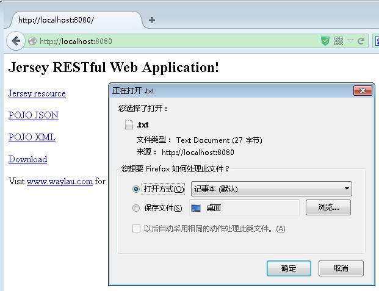
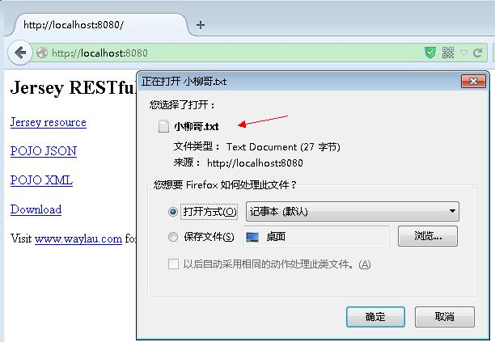
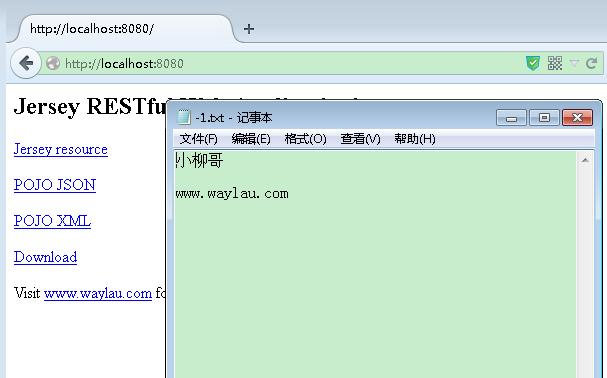
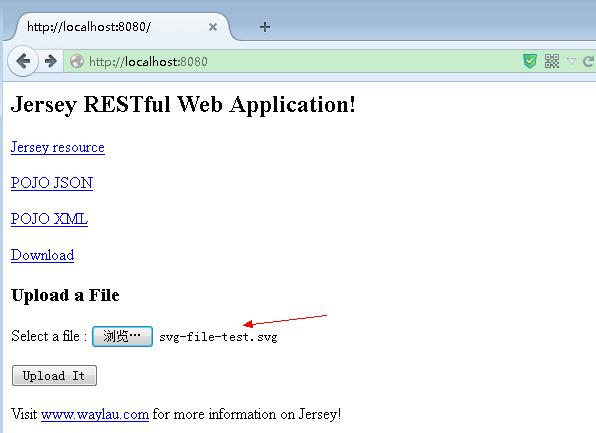
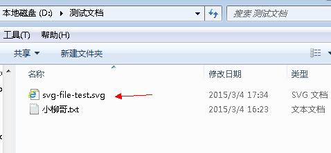

File Upload and Download 文件上传、下载
==========

文件上传下载，是一般管理系统中经常会使用的操作。下面介绍下 REST 里面是如何实现的。

##FileResource

我们在`com.waylau.rest.resource` 目录下创建 FileResource 资源类,在里面写两个路径，filepath 是文件下载路径，serverLocation 是文件上传的目录。当然 “小柳哥.txt” 这个文件是必须存在的。 

	private static final String filepath = "D:/测试文档/小柳哥.txt";
	private static final String serverLocation = "D:/测试文档/";

##文件下载

###下载服务端

在 FileResource 资源类中添加 文件下载的代码如下：

    @GET
    @Path("download")
	@Consumes(MediaType.APPLICATION_JSON)
	@Produces(MediaType.APPLICATION_OCTET_STREAM)
	public Response downloadFile() {

    	File file = new File(filepath);
		if (file.isFile() && file.exists()) {
			String mt = new MimetypesFileTypeMap().getContentType(file);
			String fileName = file.getName();
 
			return Response
					.ok(file, mt)
					.header("Content-disposition",
							"attachment;filename=" + fileName)
					.header("ragma", "No-cache")
					.header("Cache-Control", "no-cache").build();

		} else {
			return Response.status(Response.Status.NOT_FOUND)
					.entity("下载失败，未找到该文件").build();
		}
	}

`@Produces(MediaType.APPLICATION_OCTET_STREAM)` 这里就说明了，文件将会以文件流的形式返回给客户端。

###下载客户端

在 index.jsp 里面添加     

	
<a href="webapi/files/download">Download</a>

###测试

好了，代码写完，我们启动项目测试下。点击 “Download”， 此时，发现文件的名称不见了。

这是因为系统解析不了编码导致的。需要将文件名称编码做下转化即可：

	//处理文件名称编码
	fileName = new String(fileName.getBytes("utf-8"),"ISO8859-1");

再次启动测试：

OK ，下载程序写完。

###处理大数量传参下载的问题

有时难免要传递的参数较大，GET 请求难以胜任，只能用 POST 来请求下载。

下面例子就是用一个隐藏的 Form 表单来传参进行文件的下载：

	var exportUrl = 'rest/files/excel/easyui-datagird'
    var form=$("<form>");//定义一个form表单
    form.attr("style","display:none");
    form.attr("target","");
    form.attr("method","post");
    form.attr("action",exportUrl);
    var input1=$("<input>");
    input1.attr("type","hidden");
    input1.attr("name","fileName");
    input1.attr("value",fileName);
    var input2=$("<input>");
    input2.attr("type","hidden");
    input2.attr("name","columns");
    input2.attr("value",JSON.stringify(columns));
    var input3=$("<input>");
    input3.attr("type","hidden");
    input3.attr("name","rowsData");
    input3.attr("value",JSON.stringify(rows));
    $("body").append(form);//将表单放置在页面中
    form.append(input1);
    form.append(input2);
    form.append(input3);
    form.submit().remove();;//表单提交并

其中，input  就是用来传递参数的。input 的 name 属性是参数的名称，value 属性是参数的值。 

服务端要做如下的处理：

	@POST
	@Path("excel/easyui-datagird")
	@Consumes(MediaType.APPLICATION_FORM_URLENCODED)
	@Produces(MediaType.APPLICATION_OCTET_STREAM)
	public Response jsonToExcle(@FormParam("fileName") String fileName,
			@FormParam("columns") String columns,
			@FormParam("rowsData") String rowsData) {
		//这里是处理的业务逻辑代码
	}

##文件上传

上传文件稍微要复杂，需要 multipart/form-data 请求。

###依赖

添加 jersey-media-multipart 到 pom.xml

	<dependency>
	    <groupId>org.glassfish.jersey.media</groupId>
	    <artifactId>jersey-media-multipart</artifactId>
	</dependency>

并在 RestApplication 里面注册  MultiPart

	public class RestApplication extends ResourceConfig {
	
		public RestApplication() {
			//资源类所在的包路径  
		    packages("com.waylau.rest.resource");
		    
		    //注册 MultiPart
		    register(MultiPartFeature.class);
		}
	}

###上传服务端

在 FileResource 资源类中添加 文件下载的代码如下：

   	@POST
    @Path("upload")
	@Consumes(MediaType.MULTIPART_FORM_DATA)
	@Produces("application/json")
	public Response uploadFile(
			@FormDataParam("file") InputStream fileInputStream,
			@FormDataParam("file") FormDataContentDisposition contentDispositionHeader) 
				throws IOException {
    	
		String fileName = contentDispositionHeader.getFileName();
		
    	File file = new File(serverLocation + fileName); 
		File parent = file.getParentFile(); 
		//判断目录是否存在，不在创建 
		if(parent!=null&&!parent.exists()){ 
			parent.mkdirs(); 
		} 
		file.createNewFile(); 
		
		OutputStream outpuStream = new FileOutputStream(file);
		int read = 0;
		byte[] bytes = new byte[1024];
 
		while ((read = fileInputStream.read(bytes)) != -1) {
			outpuStream.write(bytes, 0, read);
		}

		outpuStream.flush();
		outpuStream.close();

		fileInputStream.close();

    	return Response.status(Response.Status.OK)
				.entity("Upload Success!").build();
    }

###上传客户端

在 index.jsp 写一个上传的 Form 表单

	<h3>Upload a File</h3>
	<form action="webapi/files/upload" method="post" enctype="multipart/form-data">
	   

		Select a file : <input type="file" name="file" size="50" />
	   

	   <input type="submit" value="Upload It" />
	</form>

###测试

选择文件，点击“Upload It”，上传成功

##源码

见 `file-upload-down`。

##参考

* 突破 URL 传值限制 <http://www.waylau.com/url-length-limitation/>

