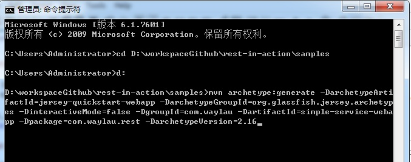
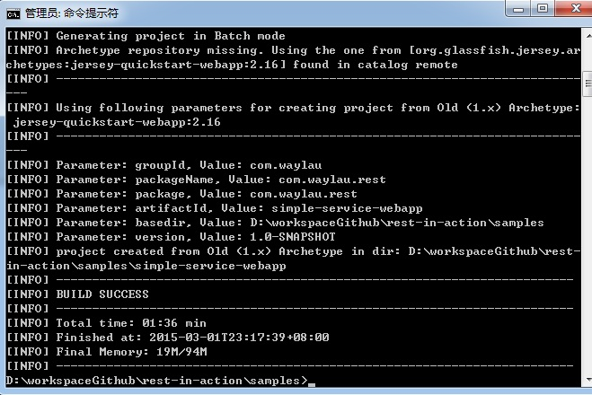

Getting Started 开始
========================

本章通过简单的示例带你快速入门。当你读完本章节，你马上就可以用 Jersey 写出 Web 应用。

##Before Getting Started 开始之前

因为我们的示例都是通过 Maven 进行管理，所谓，在开始之前，假设你已经具备 Maven 的基础知识。如果你是 Maven 新手，可以参考<http://www.waylau.com/apache-maven-3-1-0-installation-deployment-and-use/> 进行 Maven 的安装，参考<http://www.waylau.com/build-java-project-with-maven/>快速进行 Maven 入门。 

##Requirements 需要环境

* JDK 7+
* Maven 3.2.x

OK,这就是所有必需的环境。当然，你可以根据自己的喜好选择使用 IDE。本书使用 [Eclipse](http://www.eclipse.org/) 4.4。

##First REST App

在工作目录，创建第一个 Maven 管理的应用，执行 

	mvn archetype:generate -DarchetypeArtifactId=jersey-quickstart-webapp -DarchetypeGroupId=org.glassfish.jersey.archetypes -DinteractiveMode=false -DgroupId=com.waylau -DartifactId=simple-service-webapp -Dpackage=com.waylau.rest -DarchetypeVersion=2.16

这个是由 Jersey 提供 Maven archetype 用来创建的 web 项目，在你的项目里面随意调整 pom.xml 内的 groupId，包号和版本号就可以成为一个新的项目。此时，simple-service-webapp 已经创建， 符合 Maven 的项目结构：

* 标准的管理配置文件 pom.xml
* 源文件路径 src/main/java
* 资源文件路径 src/main/resources
* web 应用文件 src/main/webapp

该项目包含一个名为 MyResouce 的JAX-RS 资源类。在 src/main/webapp/WEB-INF 下，它包含了标准的JavaEE Web 应用的 web.xml 部署描述符。项目中的最后一个组件是一个 index.jsp 页面作为这次 MyResource 资源类打包和部署的应用程序客户端。

项目打包成 WAR,执行:

	mvn clean package

打包成功，如下：
	
	[INFO]
	[INFO] --- maven-war-plugin:2.2:war (default-war) @ simple-service-webapp ---
	[INFO] Packaging webapp
	[INFO] Assembling webapp [simple-service-webapp] in [D:\workspaceGithub\Jersey-2
	.x-User-Guide-Demos\demo-1.4\simple-service-webapp\target\simple-service-webapp]
	
	[INFO] Processing war project
	[INFO] Copying webapp resources [D:\workspaceGithub\Jersey-2.x-User-Guide-Demos\
	demo-1.4\simple-service-webapp\src\main\webapp]
	[INFO] Webapp assembled in [176 msecs]
	[INFO] Building war: D:\workspaceGithub\Jersey-2.x-User-Guide-Demos\demo-1.4\sim
	ple-service-webapp\target\simple-service-webapp.war
	[INFO] WEB-INF\web.xml already added, skipping
	[INFO] ------------------------------------------------------------------------
	[INFO] BUILD SUCCESS
	[INFO] ------------------------------------------------------------------------
	[INFO] Total time: 02:29 min
	[INFO] Finished at: 2014-08-30T10:05:56+08:00
	[INFO] Final Memory: 12M/29M
	[INFO] ------------------------------------------------------------------------

打包的 WAR（位于`./target/simple-service-webapp.war`）可以将它部署到您任意的 Servlet 容器，比如 [Tomcat](http://tomcat.apache.org/)、 [Jetty](http://www.eclipse.org/jetty/)、JBoss 等。
 

浏览器访问该项目

点击“Jersey resource”,可以在页面输出资源“Got it!”

**注意**：部署 Jersey 项目，Servlet 容器版本应该是不低于2.5，如果想支持更高的特性(比如 JAX-RS 2.0 Async Support) ，Servlet容器版本应该是不低于3.0

自此，第一个 REST 项目完成。