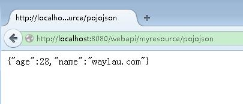
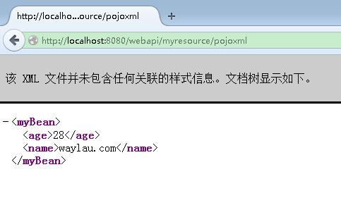

Handle JSON and XML 处理 JSON 和 XML
==========

##一个 POJO 对象

为了项目更加清晰，我们建立 `com.waylau.rest.bean`,在该包下面创建一个 POJO 对象 MyBean：

	public class MyBean {
	
		private String name;
		private int age;
	 
		public String getName() {
			return name;
		}
		public void setName(String name) {
			this.name = name;
		}
		public int getAge() {
			return age;
		}
		public void setAge(int age) {
			this.age = age;
		}
	}

##JSON 处理

我们想把这个对象返回给客户端，在 MyResource 资源下，写了

    /**
     * 方法处理 HTTP GET 请求。返回的对象以"application/json"媒体类型
	 * 给客户端
     *
     * @return MyPojo 以 application/json 形式响应
     */
    @GET
    @Path("pojojson")
    @Produces(MediaType.APPLICATION_JSON)
    public MyBean getPojoJson() {
    	MyBean pojo = new MyBean();
    	pojo.setName("waylau.com");
    	pojo.setAge(28);
        return pojo;
    }

其中 `@Produces(MediaType.APPLICATION_XML)`意思是以 JSON 形式将对象返回给客户端。

在 index.jsp 里面，我们写了一个调用该 API 的方法

    
<a href="webapi/myresource/pojojson">POJO JSON</a>

启动项目，点击“POJO JSON”,后台提示如下错误

	org.glassfish.jersey.message.internal.WriterInterceptorExecutor$TerminalWriterInterceptor aroundWriteTo
	SEVERE: MessageBodyWriter not found for media type=application/json, type=class com.waylau.rest.bean.MyPojo, genericType=class com.waylau.rest.bean.MyPojo.

那是因为 POJO 对象未被序列化成 JSON 对象，所以找不到，下面介绍几种常用的序列化手段。

###采用 MOXy

需要添加 jersey-media-moxy 依赖库在你的 pom.xml 来使用 MOXy

	<dependency>
    	<groupId>org.glassfish.jersey.media</groupId>
    	<artifactId>jersey-media-moxy</artifactId>
	</dependency>

由于 JSON 绑定特性是在自动发现的列表里，所以无需再注册该特性就使用了。（关于“自动发现”，详见《[Jersey 2.x 用户指南](https://github.com/waylau/Jersey-2.x-User-Guide)》“4.3.自动发现的特性”一节）

启动项目，点击“POJO JSON”,页面输出

	{"age":28,"name":"waylau.com"}

###采用 Jackson (2.x)

使用 Jackson 2.x 需添加 jersey-media-json-jackson 模块到 pom.xml:

	<dependency>
		<groupId>org.glassfish.jersey.media</groupId>
		<artifactId>jersey-media-json-jackson</artifactId>
	</dependency>

##XML 处理

我们想把这个对象返回给客户端，在 MyResource 资源下，写了

    /**
     * 方法处理 HTTP GET 请求。返回的对象以"application/xml"媒体类型
	 * 给客户端
     *
     * @return MyPojo 以 application/xml 形式响应
     */
    @GET
    @Path("pojoxml")
    @Produces(MediaType.APPLICATION_XML)
    public MyBean getPojoXml() {
    	MyBean pojo = new MyBean();
    	pojo.setName("waylau.com");
    	pojo.setAge(28);
        return pojo;
    }
	    

其中 `@Produces(MediaType.APPLICATION_XML)`意思是以 XML 形式将对象返回给客户端

在 index.jsp 里面，我们写了一个调用该 API 的方法

    
<a href="webapi/myresource/pojoxml">POJO XML</a>

启动项目，点击“POJO XML”,后台提示如下错误

	org.glassfish.jersey.message.internal.WriterInterceptorExecutor$TerminalWriterInterceptor aroundWriteTo
	SEVERE: MessageBodyWriter not found for media type=application/xml, type=class com.waylau.rest.bean.MyPojo, genericType=class com.waylau.rest.bean.MyPojo.

那是因为 POJO 对象未被序列化成 XML 对象，所以找不到，解决方法很简单，在 MyBean 上面加上`@XmlRootElement`注解即可

	@XmlRootElement
	public class MyBean {
	
		private String name;
		private int age;
	 
		public String getName() {
			return name;
		}
		public void setName(String name) {
			this.name = name;
		}
		public int getAge() {
			return age;
		}
		public void setAge(int age) {
			this.age = age;
		}
	}

[@XmlRootElement](http://jaxb.java.net/nonav/2.2.7/docs/api/javax/xml/bind/annotation/XmlRootElement.html) 作用是将一个类或一个枚举类型映射为一个 XML 元素。

再次启动项目，点击“POJO XML”,显示正常

##源码 

见 `handle-json-xml`项目。