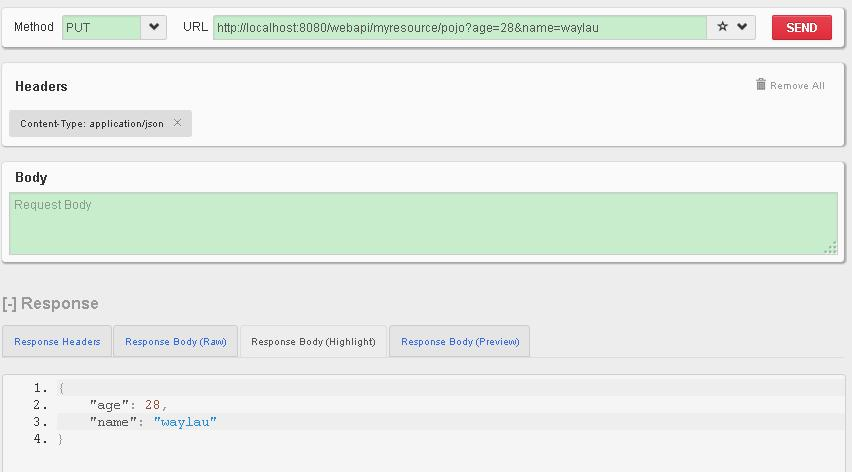

Parameter Annotations 常用参数注解
==========

在前面的章节中，我们已经了解了几个参数注解，比如 通过 [@PathParam](http://jax-rs-spec.java.net/nonav/$%7Bjaxrs.api.version%7D/apidocs/javax/ws/rs/PathParam.html) 来获取 URL 请求中的路径参数。

##@QueryParam

[@QueryParam](http://jax-rs-spec.java.net/nonav/2.0/apidocs/javax/ws/rs/QueryParam.html) 用于从请求 URL 的查询组件中提取查询参数。我们在 MyResource 里面添加下面的方法：

    @PUT
    @Path("pojo")
    @Consumes(MediaType.APPLICATION_JSON)  
    @Produces(MediaType.APPLICATION_JSON)
    public MyBean putPojo(@QueryParam("age") int age, 
    		@QueryParam("name") String name) {
    	MyBean pojo = new MyBean();
    	pojo.setName(name);
    	pojo.setAge(age);
        return pojo;
	}

这个 PUT 方法，将会接收从URL 传递过来的参数 age,name ，而后将这些参数赋给对象 MyBean ，并且返回。

启动服务，在 RESTClient 里面发送 PUT 请求 <http://localhost:8080/webapi/myresource/pojo?age=28&name=waylau> 。成功后就能接收到一个 JSON 数据对象。

    {
       "age": 28,
       "name": "waylau"
    }

##@DefaultValue

如果需要为参数设置默认值，可以使用 [@DefaultValue](http://jax-rs-spec.java.net/nonav/2.0/apidocs/javax/ws/rs/DefaultValue.html)，如：

我们在 MyResource 里面添加下面的方法：

    @POST
    @Path("pojo")
    @Consumes(MediaType.APPLICATION_JSON)  
    @Produces(MediaType.APPLICATION_JSON)
    public MyBean postPojoDefault(@DefaultValue("21") @QueryParam("age") int age, 
    		@DefaultValue("www.waylau.com")@QueryParam("name") String name) {
    	MyBean pojo = new MyBean();
    	pojo.setName(name);
    	pojo.setAge(age);
        return pojo;
    }

启动服务，在 RESTClient 里面发送 POST 请求调用 `http://localhost:8080/webapi/myresource/pojo` 接口，如果该请求包含参数，则将参数值以对象形式放回，否则，将默认值以对象形式放回

例如，当我们的请求是<http://localhost:8080/webapi/myresource/pojo?age=26&name=waylau>

则返回

    {
       "age": 26,
       "name": "waylau"
    }

当我们的请求是<http://localhost:8080/webapi/myresource/pojo>

则返回默认值

    {
       "age": 21,
       "name": "www.waylau.com"
    }

##@FormParam

[@FormParam](http://jax-rs-spec.java.net/nonav/2.0/apidocs/javax/ws/rs/FormParam.html) 顾名思义是处理 HTML表单请求的。要求所请求 MIME 媒体类型为 `application/x-www-form-urlencoded`，并且符合指定的 HTML 编码的形式，此参数提取对于 HTML 表单 POST 请求是非常有用的。比如，我们要处理一个登陆表单，处理如下：

	@POST
	@Consumes(MediaType.APPLICATION_FORM_URLENCODED)
	@Produces(MediaType.APPLICATION_JSON)
	public Response login(@FormParam("username") String username,
			@FormParam("password") String password) {
		//业务逻辑省略...
		return null;
	}

##其他

其他的参数注解还包括 

* [@MatrixParam](http://jax-rs-spec.java.net/nonav/2.0/apidocs/javax/ws/rs/MatrixParam.html) 从 URL 路径提取信息
* [@HeaderParam](http://jax-rs-spec.java.net/nonav/2.0/apidocs/javax/ws/rs/HeaderParam.html) 从 HTTP 头部提取信息
* [@CookieParam](http://jax-rs-spec.java.net/nonav/2.0/apidocs/javax/ws/rs/CookieParam.html)从关联在 HTTP 头部的 cookies 里提取信息
* [@BeanParam](http://jax-rs-spec.java.net/nonav/2.0/apidocs/javax/ws/rs/BeanParam.html) 允许注入参数到一个 bean 
* [@Context](http://jax-rs-spec.java.net/nonav/2.0/apidocs/javax/ws/rs/core/Context.html) 一般可以用于获得一个Java类型关联请求或响应的上下文。

##源码

见 `parameter-annotations`。