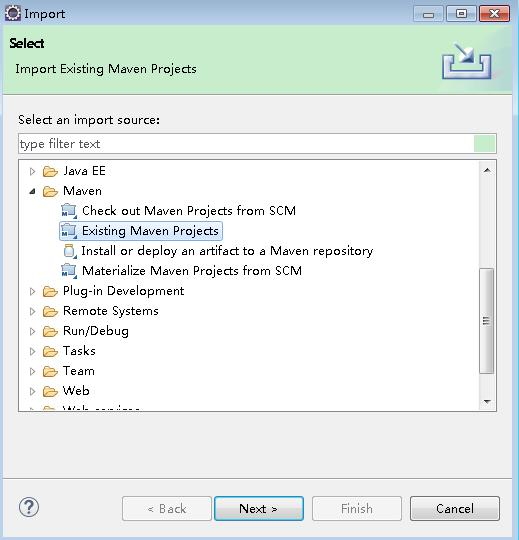
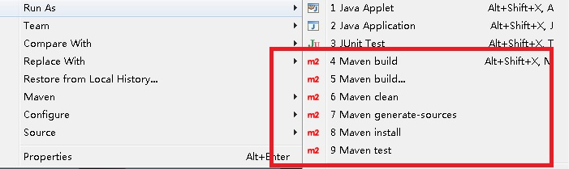
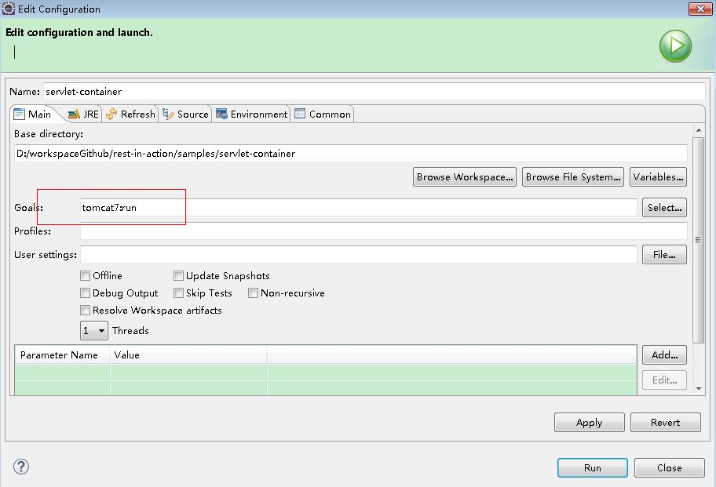
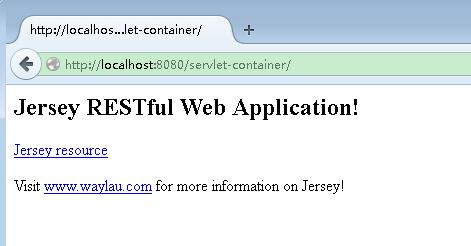
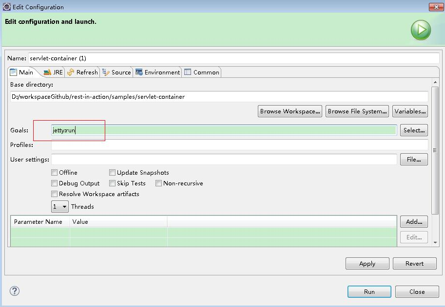
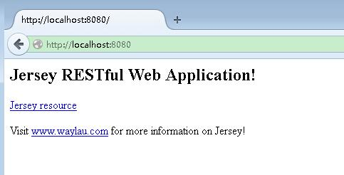

Rapid Development 快速开发
========================

为了快速开发，首先是需要一款趁手的 IDE。 IDE 的选取以个人喜好为主，只要是自己熟悉的就好。本书的实例是使用 [Eclipse](http://www.eclipse.org/) 作为 IDE。

##安装 M2Eclipse 插件

一般 Eclipse 都集成 Maven 的插件，如果没有，要想在 Eclipse 中使用 Maven，需要 安装 M2Eclipse 插件。有关 M2Eclipse 的安装可以参考<http://www.eclipse.org/m2e/>。安装完后就能导入 Maven 项目，使用 Maven 的命令行。

##内嵌 Servlet 容器

放了方便运行项目，可以将  Servlet 容器嵌入进项目中。下面谈下几种 常见的 Servlet 容器的嵌入。

###嵌入 Tomcat

设置依赖

	<plugin>
		<groupId>org.apache.tomcat.maven</groupId>
		<artifactId>tomcat7-maven-plugin</artifactId>
		<version>${tomcat7.version}</version>
	</plugin>

执行 

	mvn tomcat7:run

项目启动成功，可以看到输出：

	[INFO] Scanning for projects...
	[INFO] 
	[INFO] Using the builder org.apache.maven.lifecycle.internal.builder.singlethreaded.SingleThreadedBuilder with a thread count of 1
	[INFO]                                                                         
	[INFO] ------------------------------------------------------------------------
	[INFO] Building servlet-container 1.0-SNAPSHOT
	[INFO] ------------------------------------------------------------------------
	[INFO] 
	[INFO] >>> tomcat7-maven-plugin:2.2:run (default-cli) @ servlet-container >>>
	[INFO] 
	[INFO] --- maven-resources-plugin:2.6:resources (default-resources) @ servlet-container ---
	[INFO] Using 'UTF-8' encoding to copy filtered resources.
	[INFO] skip non existing resourceDirectory D:\workspaceGithub\rest-in-action\samples\servlet-container\src\main\resources
	[INFO] 
	[INFO] --- maven-compiler-plugin:2.5.1:compile (default-compile) @ servlet-container ---
	[INFO] Compiling 1 source file to D:\workspaceGithub\rest-in-action\samples\servlet-container\target\classes
	[INFO] 
	[INFO] <<< tomcat7-maven-plugin:2.2:run (default-cli) @ servlet-container <<<
	[INFO] 
	[INFO] --- tomcat7-maven-plugin:2.2:run (default-cli) @ servlet-container ---
	[INFO] Running war on http://localhost:8080/servlet-container
	[INFO] Creating Tomcat server configuration at D:\workspaceGithub\rest-in-action\samples\servlet-container\target\tomcat
	[INFO] create webapp with contextPath: /servlet-container
	三月 02, 2015 2:25:06 下午 org.apache.coyote.AbstractProtocol init
	INFO: Initializing ProtocolHandler ["http-bio-8080"]
	三月 02, 2015 2:25:07 下午 org.apache.catalina.core.StandardService startInternal
	INFO: Starting service Tomcat
	三月 02, 2015 2:25:07 下午 org.apache.catalina.core.StandardEngine startInternal
	INFO: Starting Servlet Engine: Apache Tomcat/7.0.47
	三月 02, 2015 2:25:11 下午 org.apache.coyote.AbstractProtocol start
	INFO: Starting ProtocolHandler ["http-bio-8080"]

在浏览器里访问 <http://localhost:8080/servlet-container/> 就能看到主页面了。

###嵌入 Jetty

设置依赖

	<plugin>
		<groupId>org.eclipse.jetty</groupId>
		<artifactId>jetty-maven-plugin</artifactId>
		<version>${jetty.version}</version>
	</plugin>

**注意**：使用该插件需要 Maven 3 和 Java 1.7 及以上版本

执行 

	mvn jetty:run

项目启动成功，可以看到输出：

	[INFO] Scanning for projects...
	[INFO] 
	[INFO] Using the builder org.apache.maven.lifecycle.internal.builder.singlethreaded.SingleThreadedBuilder with a thread count of 1
	[INFO]                                                                         
	[INFO] ------------------------------------------------------------------------
	[INFO] Building servlet-container 1.0-SNAPSHOT
	[INFO] ------------------------------------------------------------------------
	[INFO] 
	[INFO] >>> jetty-maven-plugin:9.2.9.v20150224:run (default-cli) @ servlet-container >>>
	[INFO] 
	[INFO] --- maven-resources-plugin:2.6:resources (default-resources) @ servlet-container ---
	[INFO] Using 'UTF-8' encoding to copy filtered resources.
	[INFO] skip non existing resourceDirectory D:\workspaceGithub\rest-in-action\samples\servlet-container\src\main\resources
	[INFO] 
	[INFO] --- maven-compiler-plugin:2.5.1:compile (default-compile) @ servlet-container ---
	[INFO] Nothing to compile - all classes are up to date
	[INFO] 
	[INFO] --- maven-resources-plugin:2.6:testResources (default-testResources) @ servlet-container ---
	[INFO] Using 'UTF-8' encoding to copy filtered resources.
	[INFO] skip non existing resourceDirectory D:\workspaceGithub\rest-in-action\samples\servlet-container\src\test\resources
	[INFO] 
	[INFO] --- maven-compiler-plugin:2.5.1:testCompile (default-testCompile) @ servlet-container ---
	[INFO] No sources to compile
	[INFO] 
	[INFO] <<< jetty-maven-plugin:9.2.9.v20150224:run (default-cli) @ servlet-container <<<
	[INFO] 
	[INFO] --- jetty-maven-plugin:9.2.9.v20150224:run (default-cli) @ servlet-container ---
	2015-03-02 15:06:54.654:INFO::main: Logging initialized @1764ms
	[INFO] Configuring Jetty for project: servlet-container
	[INFO] webAppSourceDirectory not set. Trying src\main\webapp
	[INFO] Reload Mechanic: automatic
	[INFO] Classes = D:\workspaceGithub\rest-in-action\samples\servlet-container\target\classes
	[INFO] Context path = /
	[INFO] Tmp directory = D:\workspaceGithub\rest-in-action\samples\servlet-container\target\tmp
	[INFO] Web defaults = org/eclipse/jetty/webapp/webdefault.xml
	[INFO] Web overrides =  none
	[INFO] web.xml file = file:/D:/workspaceGithub/rest-in-action/samples/servlet-container/src/main/webapp/WEB-INF/web.xml
	[INFO] Webapp directory = D:\workspaceGithub\rest-in-action\samples\servlet-container\src\main\webapp
	2015-03-02 15:06:54.713:INFO:oejs.Server:main: jetty-9.2.9.v20150224
	2015-03-02 15:06:55.885:INFO:oejsh.ContextHandler:main: Started o.e.j.m.p.JettyWebAppContext@2863c{/,file:/D:/workspaceGithub/rest-in-action/samples/servlet-container/src/main/webapp/,AVAILABLE}{file:/D:/workspaceGithub/rest-in-action/samples/servlet-container/src/main/webapp/}
	2015-03-02 15:06:55.886:WARN:oejsh.RequestLogHandler:main: !RequestLog
	[INFO] Started Jetty Server
	2015-03-02 15:06:55.911:INFO:oejs.ServerConnector:main: Started ServerConnector@1dde93{HTTP/1.1}{0.0.0.0:8080}
	2015-03-02 15:06:55.912:INFO:oejs.Server:main: Started @3022ms

在浏览器里访问 <http://localhost:8080>就能看到主页面了。这里 Jetty 启动项目是默认是不显示项目名称的。

##参考：

* <http://www.eclipse.org/jetty/documentation/current/jetty-maven-plugin.html>
* <http://tomcat.apache.org/maven-plugin.html>
* Tomcat Maven Plugin使用 <http://www.waylau.com/tomcat-maven-plugin/>