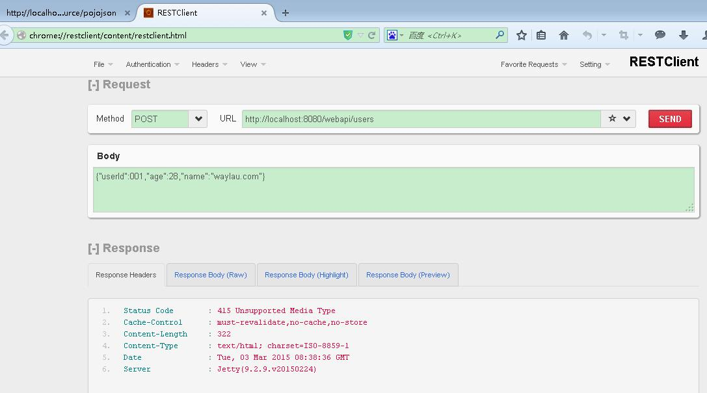
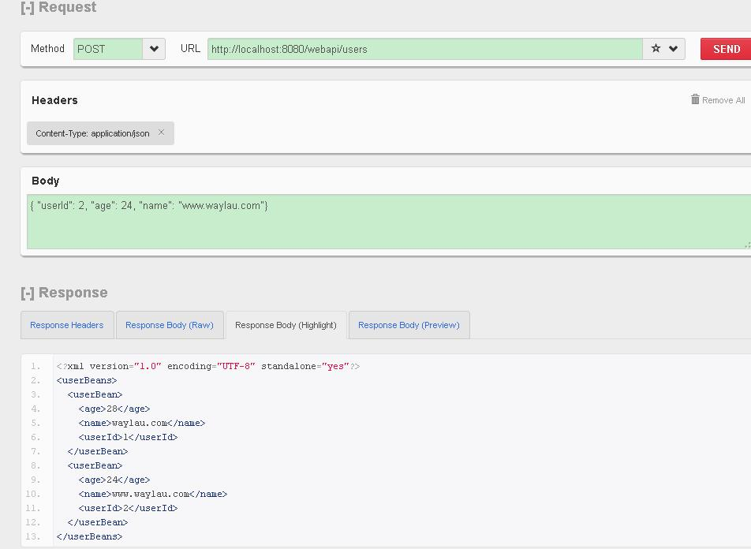
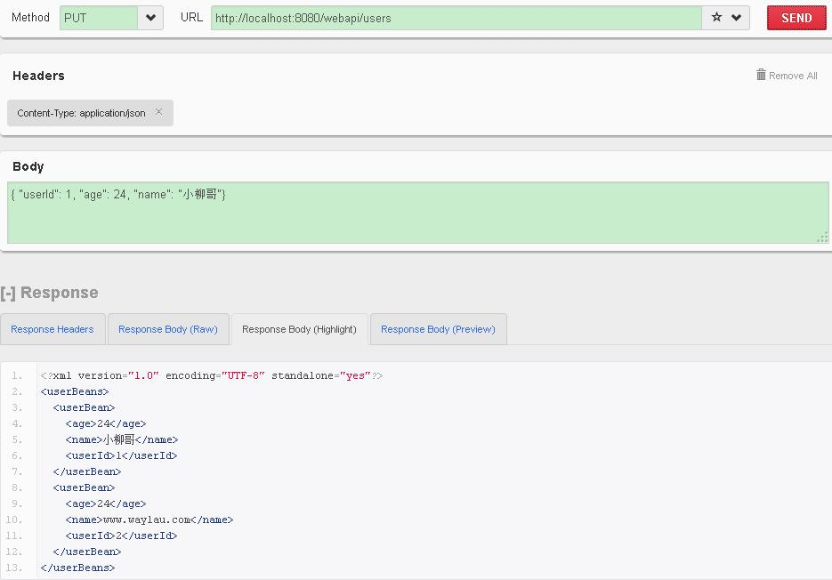
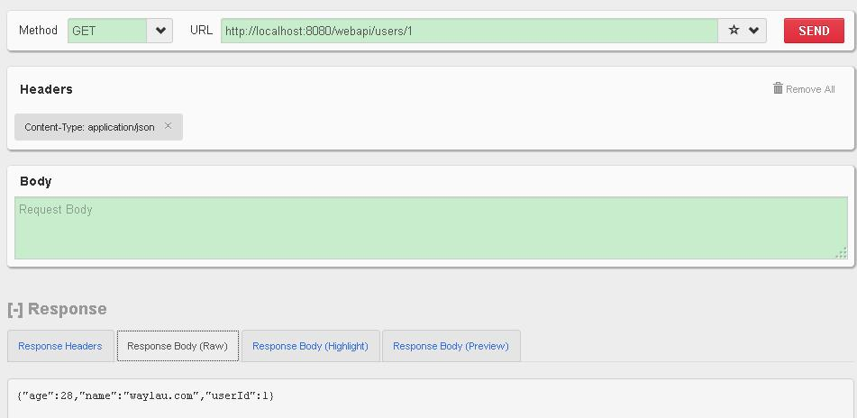
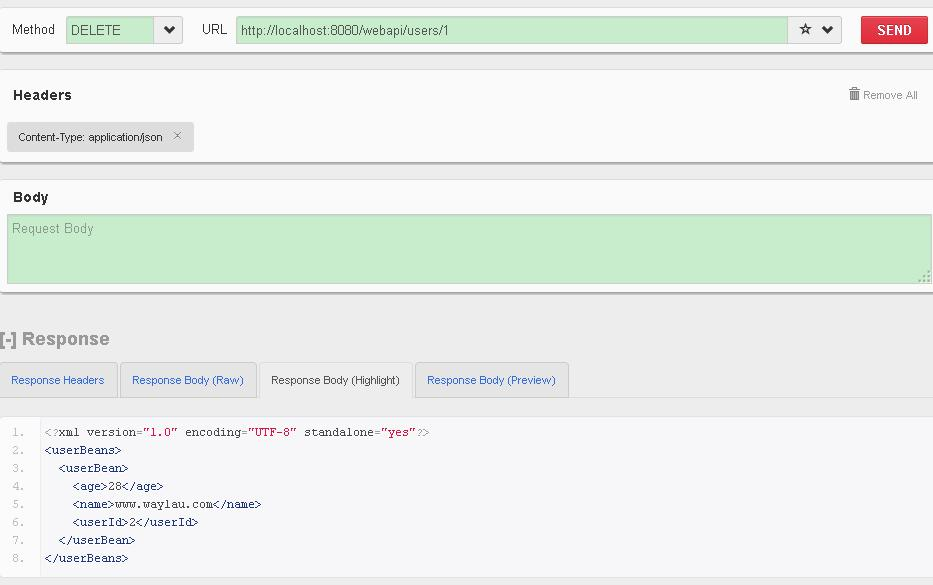

Simulation of CURD 模拟CURD操作
===========

下面，我们要尝试下管理系统中最常用的几个 CURD 操作，来模拟一个“用户管理”。

##服务端

在服务端，我们要提供 REST 风格的 API。

###UserBean

先创建一个用户对象 UserBean.java
	
	@XmlRootElement
	public class UserBean {
	
		private int userId;
		private String name;
		private int age;
		
		public int getUserId() {
			return userId;
		}
	
		public void setUserId(int userId) {
			this.userId = userId;
		}
	
		public String getName() {
			return name;
		}
	
		public void setName(String name) {
			this.name = name;
		}
	
		public int getAge() {
			return age;
		}
	
		public void setAge(int age) {
			this.age = age;
		}
	}

###UserResource

新建一个资源类 UserResource.java 。加`@Path("users")`注解用来说明 资源根路径是 `users`.

添加

	private static Map<Integer,UserBean> userMap  = new HashMap<Integer,UserBean>();

用来在内存中存储数据。可以在 userMap 获取我们想要查询的数据。

完整的代码如下：

	@Path("users")
	public class UserResource {
		
		private static Map<Integer,UserBean> userMap  = new HashMap<Integer,UserBean>();
		/** 
	     * 增加 
	     * @param user 
	     */  
	    @POST  
	    @Consumes(MediaType.APPLICATION_JSON)  
	    public List<UserBean> createUser(UserBean user)  
	    {  
	        userMap.put(user.getUserId(), user );  
	        return getAllUsers(); 
	    }  
	
	    /** 
	     * 删除 
	     * @param id 
	     */  
	    @DELETE  
	    @Path("{id}")  
	    public List<UserBean> deleteUser(@PathParam("id")int id){  
	        userMap.remove(id); 
	        return getAllUsers(); 
	    }  
	
	    /** 
	     * 修改 
	     * @param user 
	     */  
	    @PUT  
	    @Consumes(MediaType.APPLICATION_JSON)  
	    public List<UserBean> updateUser(UserBean user){  
	        userMap.put(user.getUserId(), user );  
	        return getAllUsers(); 
	    }  
	
	    /** 
	     * 根据id查询 
	     * @param id 
	     * @return 
	     */  
	    @GET  
	    @Path("{id}")  
	    @Produces(MediaType.APPLICATION_JSON)  
	    public UserBean getUserById(@PathParam("id") int id){  
	    	UserBean u = userMap.get(id);  
	        return u;  
	    }  
	
	    /** 
	     * 查询所有 
	     * @return 
	     */  
	    @GET  
	    @Produces(MediaType.APPLICATION_JSON)  
	    public List<UserBean> getAllUsers(){       
	        List<UserBean> users = new ArrayList<UserBean>();     
	        users.addAll( userMap.values() );    
	        return users;  
	    }  
	}

为了简单起见，我们约定 POST 就是处理新增，PUT 用来做修改，DELETE 删除，GET 就是查询。

自此，服务端接口开发完毕。

##客户端

为了快速测试接口，可以用第三方 REST 客户端测试程序，我这里用的是 RESTClient 插件，可以在火狐中安装使用。

###增加用户

我们先增加一个用户对象，使用 JSON 格式：
	
	{
	    "userId": 1,
	    "age": 28,
	    "name": "waylau.com"
	}

提示报错：`415` 未支持媒体格式的错误。

由于我们在新增的接口里面设置的是

    @Consumes(MediaType.APPLICATION_JSON)  

规定只接收 JSON 格式，而 默认的 “Conten-Type” 是“text/html”所以在还需要在 header 里设置一下 为 “application/json”：

就可以了。我们在添加一个用户对象

	{
	    "userId": 2,
	    "age": 24,
	    "name": "www.waylau.com"
	}

响应的数据里面就能看到我们的添加的用户了。

###修改用户

修改用户1 的数据：

	{
	    "userId": 1,
	    "age": 24,
	    "name": "小柳哥"
	}

用 PUT 请求：

在返回的数据里面可以看到用户1 被修改

###查询用户

在根据 ID 查询的接口里面

    @GET  
    @Path("{id}")  
    @Produces(MediaType.APPLICATION_JSON)  
    public UserBean getUserById(@PathParam("id") int id){  
    	UserBean u = userMap.get(id);  
        return u;  
    } 

`@Path("{id}")`指 id 这个子路径是一个变量。我们查询用户1 时，要将用户 1 的 userId 放在请求的URI 里面`http://localhost:8080/webapi/users/1`

###删除用户

与上面类似，也是用到了`@Path("{id}")`

我们看到用户1被删除了。

自此整个应用完成了。这个“用户管理”够简单吧~

##源码

见 `simulation-curd`。